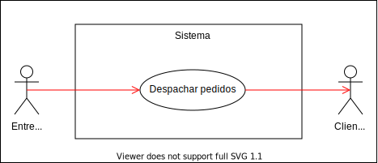
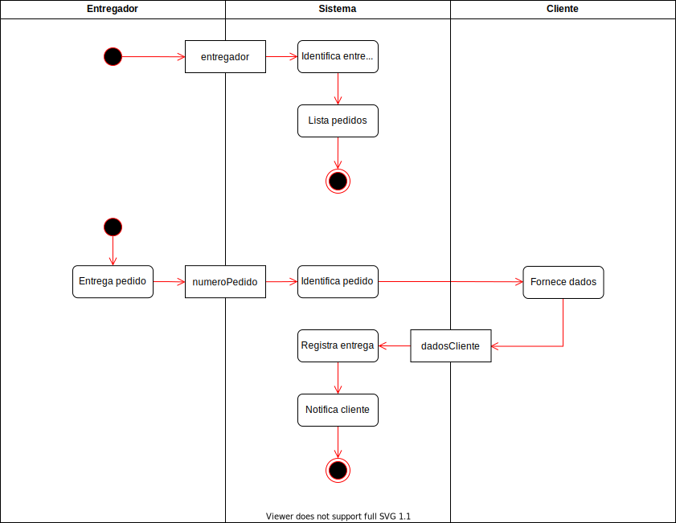
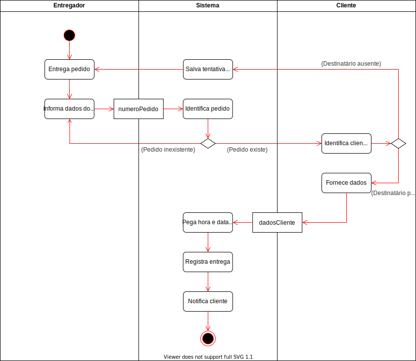
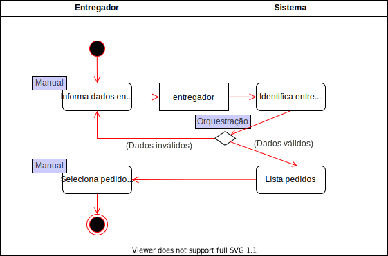
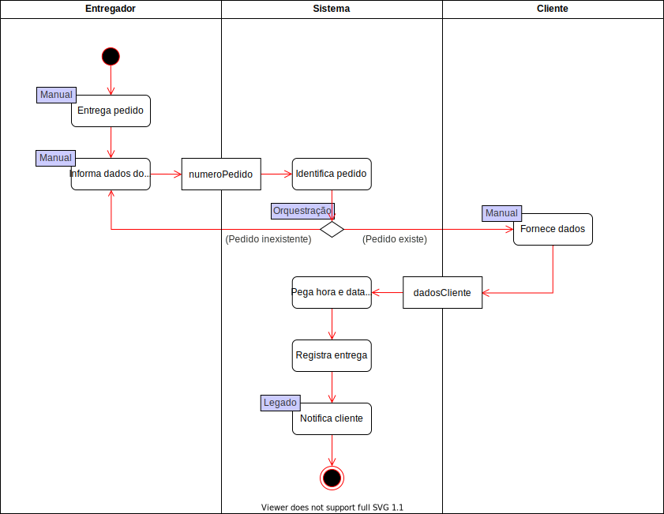
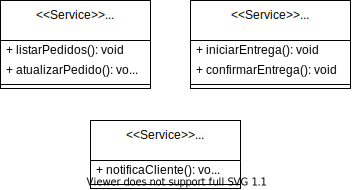
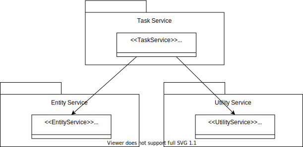
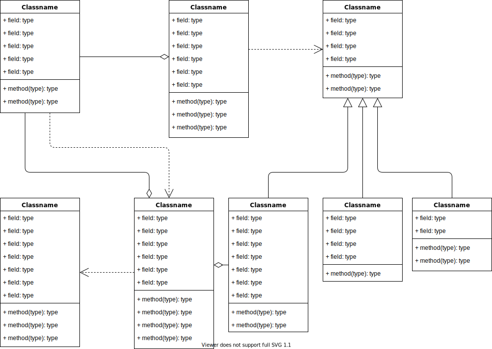

# Análise

## Requisitos:

  * Consultar a lista de pedidos a serem entregues;
  * Registrar a entrega de um pedido;
  * Enviar um e-mail para o cliente quando o pedido for entregue.

## Fronteiras da análise:

  * O entregador consulta a lista de pedidos a serem entregues;
  * O entregador registra a entrega de um pedido;
  * O sistema acessa o servidor de e-mails.

## Partes envolvidas:

  * Entregador;
  * Cliente.

## Partes afetadas da corporação:

  * Vendas;
  * Logística.

# Modelagem

  Para entender melhor o sistema de logística, serão apresentados alguns diagramas no qual demonstram todas as características e funcionalidades do serviço.

  ## Diagrama de caso de uso (UML):

  Este diagrama demonstra de forma simplificada o principal objetivo do sistema de logística, no qual tem como principal utilidade o despache de pedidos por parte do entregador.

  

    
    <em>
      <b>Figura 1: Caso de uso do serviço de logística.</b>
    </em>
  

  ## Modelo de negócio:

  Este diagrama demonstra todo processo do sistema de logística, desde a parte em que o entregador consulta os pedidos pendentes para entrega, até o momento em que o pedido é entregue ao cliente. Após a entrega, o sistema registra a entrega e envia um email ao cliente com as informações da entrega.

  

    
    <em>
      <b>Figura 2: Modelo de processo de negócio do serviço de logística.</b>
    </em>
  

  ## Modelo de negócio detalhado (Listagem de pedidos):

  Este diagrama detalha a parte de listagem de pedidos por parte do entregador. Nele conseguimos observar todos os passos necessários para que o entregador consiga consultar os pedidos pendentes para entrega. De forma resumida, o entregar entra com os dados no sistema, é feita a validação desses dados e então todos os pedidos são listados.

  

    
    <em>
      <b>Figura 3: Modelo detalhado do serviço de logística - Listagem de pedidos.</b>
    </em>
  

  ## Modelo de negócio detalhado (Entrega):

  Este diagrama detalha a parte de entrega do pedido por parte do entregador. Como pode ser observado, após o pedido ser entregue ao cliente, o entregador acessa o sistema, entra com o código do pedido e registra a entrega do pedido. Assim que a entrega é registrada, um email é enviado ao cliente automaticamente com as informações da entrega.

  

    
    <em>
      <b>Figura 4: Modelo detalhado do serviço de logística - Entrega.</b>
    </em>
  

  ## Definição dos serviços:

  Os diagramas a seguir indicam os tipos de serviços presentes no modelo, seguindo as seguines definições:

  * Manual: Ação feita manualmente por parte do entregador ou cliente;
  * Orquestração: Validação de dados realizada pelo sistema;
  * Legado: Sistema externo que será utilizado pelo sistema de logística.

  

    
    <em>
      <b>Figura 5: Marcação dos serviços - Listagem de pedidos.</b>
    </em>
  

  

    
    <em>
      <b>Figura 6: Marcação dos serviços - Entrega.</b>
    </em>
  

  # Relação entre os serviços

  

    
    <em>
      <b>Figura 7: Relação de serviços refinada.</b>
    </em>
  

  # Projeto

  

    
    <em>
      <b>Figura 8: Relacionamento entre os serviços.</b>
    </em>
  

  

    
    <em>
      <b>Figura 9: Diagrama de classes com os serviços detalhados.</b>
    </em>
  

