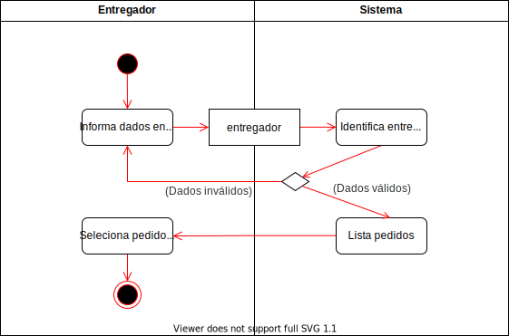

# Análise

## Requisitos:

  * Consultar a lista de pedidos a serem entregues;
  * Registrar a entrega de um pedido;
  * Enviar um e-mail para o cliente quando o pedido for entregue.

## Fronteiras da análise:

  * O entregador consulta a lista de pedidos a serem entregues;
  * O entregador registra a entrega de um pedido;
  * O sistema acessa o servidor de e-mails.

## Partes envolvidas:

  * Entregador;
  * Cliente.

## Partes afetadas da corporação:

  * Vendas;
  * Logística.

# Modelagem

  

    
    <em>
      <b>Figura 1: Caso de uso do serviço de logística.</b>
    </em>
  

  

    
    <em>
      <b>Figura 2: Modelo de processo de negócio do serviço de logística.</b>
    </em>
  

  

    
    <em>
      <b>Figura 3: Modelo detalhado do serviço de logística - Listagem de pedidos.</b>
    </em>
  

  

    
    <em>
      <b>Figura 4: Modelo detalhado do serviço de logística - Entrega.</b>
    </em>
  

  

    
    <em>
      <b>Figura 5: Marcação dos serviços - Listagem de pedidos.</b>
    </em>
  

  

    
    <em>
      <b>Figura 6: Marcação dos serviços - Entrega.</b>
    </em>
  

