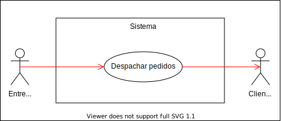
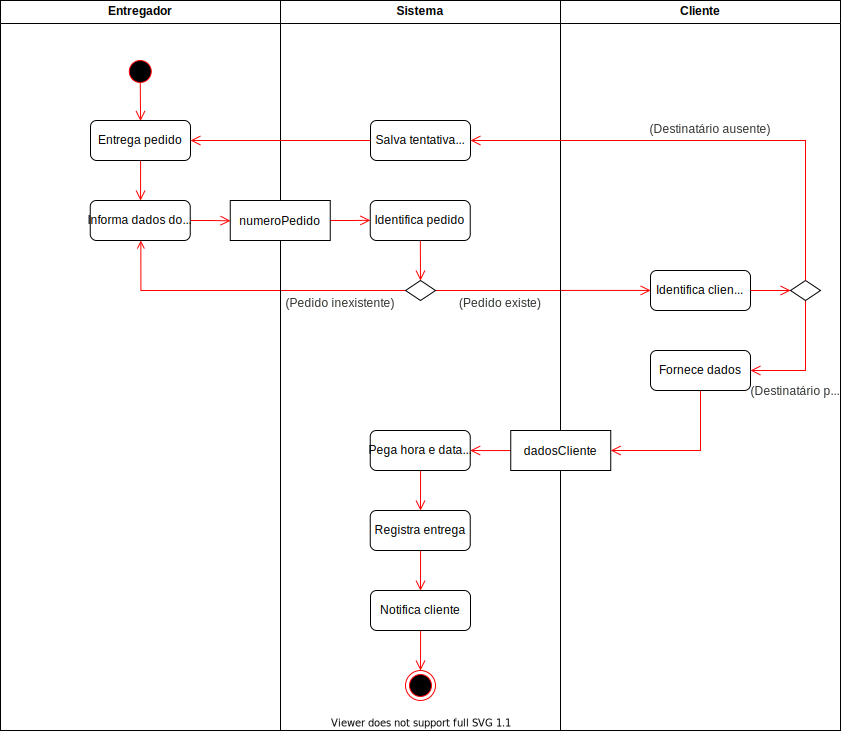
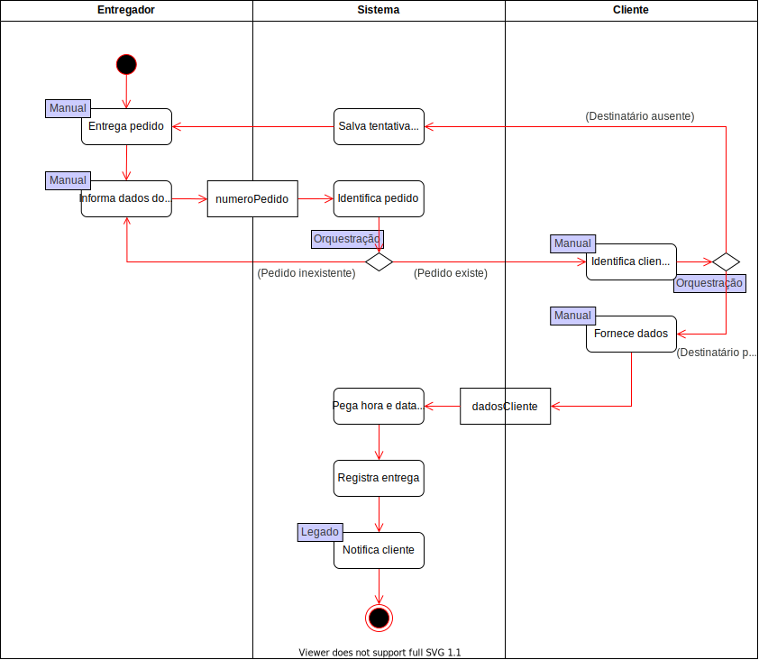
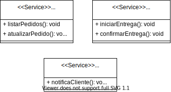
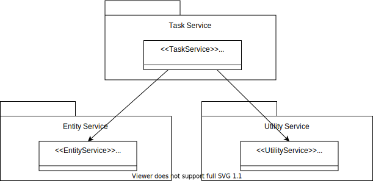
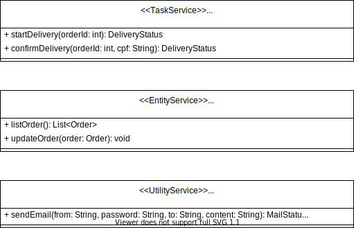

# Análise

## Requisitos:

  * Consultar a lista de pedidos a serem entregues;
  * Registrar a entrega de um pedido;
  * Enviar um e-mail para o cliente quando o pedido for entregue.

## Fronteiras da análise:

  * O entregador consulta a lista de pedidos a serem entregues;
  * O entregador registra a entrega de um pedido;
  * O sistema acessa o servidor de e-mails.

## Partes envolvidas:

  * Entregador;
  * Cliente.

## Partes afetadas da corporação:

  * Vendas;
  * Logística.

# Modelagem

  Para entender melhor o sistema de logística, serão apresentados alguns diagramas no qual demonstram todas as características e funcionalidades do serviço.

  ## Diagrama de caso de uso (UML):

  Este diagrama demonstra de forma simplificada o principal objetivo do sistema de logística, no qual tem como principal utilidade o despache de pedidos por parte do entregador.

  

    
    <em>
      <b>Figura 1: Caso de uso do serviço de logística.</b>
    </em>
  

  ## Modelo de negócio:

  Este diagrama demonstra todo processo do sistema de logística, desde a parte em que o entregador consulta os pedidos pendentes para entrega, até o momento em que o pedido é entregue ao cliente. Após a entrega, o sistema registra a entrega e envia um email ao cliente com as informações da entrega.

  

    
    <em>
      <b>Figura 2: Modelo de processo de negócio do serviço de logística.</b>
    </em>
  

  ## Modelo de negócio detalhado (Listagem de pedidos):

  Este diagrama detalha a parte de listagem de pedidos por parte do entregador. Nele conseguimos observar todos os passos necessários para que o entregador consiga consultar os pedidos pendentes para entrega. De forma resumida, o entregar entra com os dados no sistema, é feita a validação desses dados e então todos os pedidos são listados.

  

    
    <em>
      <b>Figura 3: Modelo detalhado do serviço de logística - Listagem de pedidos.</b>
    </em>
  

  ## Modelo de negócio detalhado (Entrega):

  Este diagrama detalha a parte de entrega do pedido por parte do entregador. Como pode ser observado, após o pedido ser entregue ao cliente, o entregador acessa o sistema, entra com o código do pedido e registra a entrega do pedido. Assim que a entrega é registrada, um email é enviado ao cliente automaticamente com as informações da entrega.

  

    
    <em>
      <b>Figura 4: Modelo detalhado do serviço de logística - Entrega.</b>
    </em>
  

  ## Definição dos serviços:

  Os diagramas a seguir indicam os tipos de serviços presentes no modelo, seguindo as seguintes definições:

  * Manual: Ação feita manualmente por parte do entregador ou cliente;
  * Orquestração: Validação de dados realizada pelo sistema;
  * Legado: Sistema externo que será utilizado pelo sistema de logística.

  

    
    <em>
      <b>Figura 5: Marcação dos serviços - Listagem de pedidos.</b>
    </em>
  

  

    
    <em>
      <b>Figura 6: Marcação dos serviços - Entrega.</b>
    </em>
  

  ## Criação de serviços candidatos:

  A partir da marcação feita, as atividades do processo de negócio são separadas para a identificação dos serviços candidatos. Para isso usaremos os serviços que não foram marcados, os marcados de legado e orquestração. Finalmente faz-se o agrupamento lógico deles:

  * Pedido:
    * Listar pedidos;
    * Validar pedido.
  * Entrega:
    * Pegar hora e data atual.
    * Registrar entrega;
    * Registrar tentativa.
  * Mensageiro:
    * Notifica cliente via e-mail.
  * CRM:
    * Identificar entregador;
    * Identificar pedido.

  ## Aplicar os princípios de orientação a serviços:

  Utilizar dos princípios para otimizar as relação de serviços:

  * Pedido:
    * Listar pedidos.
  * Entrega:
    * Registrar tentativa de entrega;
    * Registrar entrega (já envolve identificar o entregador e pedido como também validar o pedido);
  * Mensageiro:
    * Notifica cliente via e-mail.

  _Obs_: Pegar hora e data atual pode ser implementado no momento do registro da entrega. Não é necessário a criação de um serviço para gerar esse dado sendo que já existe funções da própria linguagem para pegar essas informações.

  ## Identificar a composição de serviços:

  Após analisar a regra de negócio observa-se a necessidade de criar o **serviço de entrega de pedido**. Este serviço fará a orquestração de duas ações importantes:

  * Iniciar o processo de entrega: faz todo o processo de registro de pendência do entrega.
  * Confirma a entrega do pedido: faz o processo de confirmação da entrega e envio de email notificando cliente.

  ## Revisar os agrupamentos de serviços:

  Um novo serviço do grupo Pedido pode ser criado, chamado de **atualizar pedido** (engloba: registrar pendência de entrega e confirmação da entrega).

  Com o novo serviço é valido uma reanálise no processo de **entrega de pedido**. Isso ocorre porque o registro da entrega utilizaria do serviço de atualizar pedido para confirmar a entrega daquele pedido.

  Com as conclusões finais podemos considerar os seguintes serviços:

  * Pedido:
    * Listar pedidos;
    * Atualizar pedidos.
  * Entrega:
    * Iniciar entrega;
    * Confirmar entrega.
  * Mensageiro:
    * Notifica cliente via e-mail.

  # Relação entre os serviços

  

    
    <em>
      <b>Figura 7: Relação de serviços refinada.</b>
    </em>
  

  # Projeto

  Nessa fase será feito as especificações do serviço.

  ## Composição da arquitetura:
  Neste trabalho será utilizada as três camadas: 
  - Task;
  - Entity;
  - Utility.

  Implementação: Serão utilizados para a linguagem Java em conjunto Spring Boot.

  ## Definir os serviços de entidades:
  Após estudos dos diagramas e das regras do negócio para esse trabalho será criado a seguinte entidade: **Pedido**.

  ## Definir os serviços de utilidade:
  O serviço reaproveitável em várias partes do sistema: **Mensageiro**.

  ## Definir os serviços de tarefa:
  O serviço de tarefa: **Entrega**.

  ## Relacionamento entre os serviços:

  

    
    <em>
      <b>Figura 8: Relacionamento entre os serviços.</b>
    </em>
  

  ## Diagrama de classes com os serviços detalhados:

  E uma versão mais detalhada dos serviços é mostrada na Figura 9, já mais próxima da implementação.

  

    
    <em>
      <b>Figura 9: Diagrama de classes com os serviços detalhados.</b>
    </em>
  

